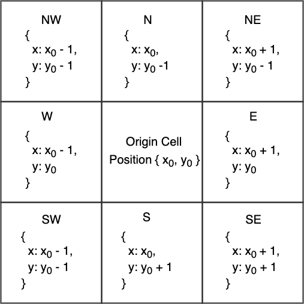

# `Cell`

A `Cell` represents a single pixel within a `BurnMatrix`. At its core, it is an abstraction layer for interacting with and making changes to the `BurnMatrix`. A `Cell` is tied to a particular `Extent`, and it has methods which enable it to access the `Extent`'s data at its own position within that `Extent`. It is also connected to the `Extent`'s `BurnMatrix`, and is able to get and set burn values at the `Cell`'s position in its `BurnMatrix`.

FireStarter's stochastic model relies on a `Cell`'s ability to access its neighboring positions within its `BurnMatrix`. To that end, a `Cell` has the `neighbors()` method, which spawns 8 `NeighborCell`s, forming a [Moore Neighborhood](https://en.wikipedia.org/wiki/Moore_neighborhood).

---

# `NeighborCell`

When a `Cell` calls its `neighbors()` method, an array of 8 `NeighborCells` is returned, representing the 8 pixels that surround the original cell.

{: width=320px }

Each `NeighborCell` has additional properties used to calculate the probability of whether or not fire will spread from a burning `Cell` to that `NeighborCell`. For example, the terrain slope from the origin cell to each neighbor is produced when calling `NeighborCell.getSlopeFromOriginCell`. Similarly the wind component in the direction of that `NeighborCell` is available by calling ``NeighborCell.getWindComponent`. In this way, the burn status of each pixel in a `BurnMatrix` is determined by each `Neighborcell`.

---

A `Campaign` always begins with a `TimeStep` in which a single `Cell` being set to _burning_. In the following `TimeStep`, the burn status of each `NeighborCell` is determined, and all burning `Cell`s are kept track of by the `BurnMatrix`. In the proceeding `TimeStep`s, all burning cells are iterated over, each burning `Cell` spawns its `NeighborCells`, whose burn statuses are determined and recorded, and so forth.
